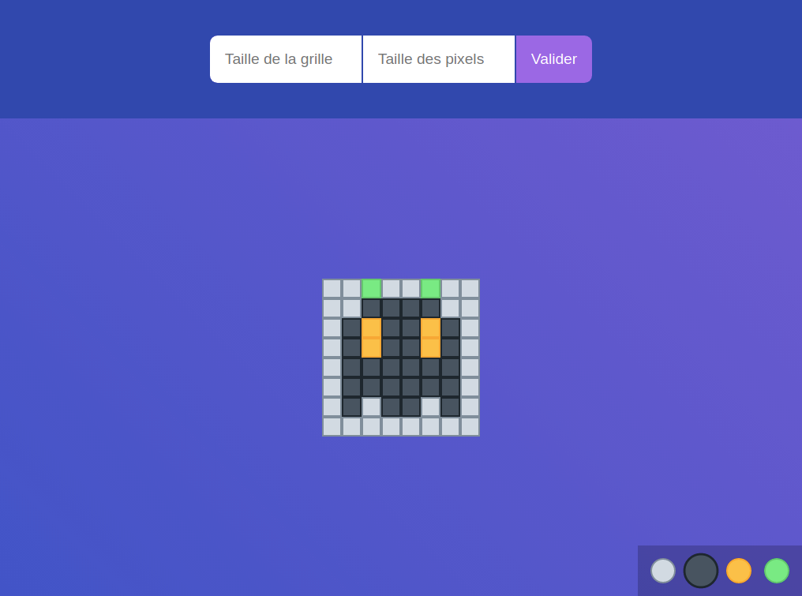

# Copie 
Si tu souhaite copier cette depo, clicker sur le bouton en huat à droite.


# Invader

:black_square_button::black_square_button::black_square_button::black_square_button::black_square_button::black_square_button::black_square_button::black_square_button::black_square_button:  
:black_square_button::black_square_button::white_square_button::white_square_button::white_square_button::white_square_button::white_square_button::black_square_button::black_square_button:  
:black_square_button::black_square_button::white_square_button::large_orange_diamond::white_square_button::large_orange_diamond::white_square_button::black_square_button::black_square_button:  
:black_square_button::white_square_button::white_square_button::white_square_button::white_square_button::white_square_button::white_square_button::white_square_button::black_square_button:  
:black_square_button::black_square_button::white_square_button::black_square_button::white_square_button::black_square_button::white_square_button::black_square_button::black_square_button:  
:black_square_button::white_square_button::black_square_button::black_square_button::white_square_button::black_square_button::black_square_button::white_square_button::black_square_button:  
:black_square_button::black_square_button::black_square_button::black_square_button::black_square_button::black_square_button::black_square_button::black_square_button::black_square_button:

Au programme :space_invader: : concevoir une application JavaScript pour créer une ardoise de dessin en pixel art dans le style du célèbre jeu [Space Invaders](https://fr.wikipedia.org/wiki/Space_Invaders).



## Étape 1 - Générer l'ardoise

- On va d'abord créer des élements en Javascript pour créer une grille de 8 cases x 8 cases
- Pour cela il faudra exploiter les boucles et ajouter des élements au DOM
- On ajoute ensuite les styles qu'on souhaite  
Il faut pouvoir visualiser toutes nos lignes et toutes nos colonnes  
Pour l'instant tous les pixels ont la même couleur ;)

<details><summary>
Un coup de main ?
</summary>

En pratique, comment s'y prendre 🤯 ?

Une technique consiste à:
- d'abord implémenter la structure désirée **directement** dans le fichier HTML (partie exploratoire), gérer les styles, etc...
- lorsqu'on est satisfait, on essaie alors d'obtenir cette même structure **mais** uniquement à l'aide du code JS, en insérant les éléments dans le DOM.
- puis on n'oublie pas de supprimer la structure qu'on avait hard-codé dans le HTML. Plus besoin !
  
</details>

## Étape 2 - Gérer le clic sur un pixel

- On va maintenant s'occuper de pouvoir changer la couleur des pixels
- Si on clique sur un pixel on le fait passer en noir
- Si on reclique dessus il passe en gris
- Si on reclique dessus il passe en noir
- Si on reclique dessus il passe en gris
- Si on reclique... 'fin bref on a compris quoi
- concrètement d'abord on doit réagir au clic sur les pixels
- ensuite on doit modifier la couleur d'arrière plan du pixel cliqué  

:thinking: Alors là si on sèche un peu, on prend tout de suite de bonnes habitudes, on n'hésite pas à revoir le code déjà produit cette saison ou la doc pour trouver des réponses.  
On a par exemple dû voir un moyen de récupérer tout plein d'informations liées à l'événement dans la fonction de rappel de l'écouteur.
Peut-être que l'une de ces informations est l'élement cliqué :man-shrugging:

## Étape 3 - Formulaire de configuration

- On va ajouter (toujours en JS) des élements au formulaire
- On ajoute un champ pour choisir la taille de la grille
- On ajoute un bouton pour valider
- Lorsqu'on soumet le formulaire on veut générer une nouvelle grille à la place de la grille actuelle, mais en tenant compte de la taille saisie dans le champ
- Par exemple l'utilisateur saisit 10 dans le champ, il valide, une nouvelle grille de 10 cases x 10 cases est générée à la place de la grille existante

---

<details>
<summary>
  Bonus <strong>facultatif</strong>
</summary>

## Un peu de rangements

- Si vous êtes arrivés jusqu'ici, déjà bravo :tada:
- Les bonus ne sont que des bonus, prenez le temps de savourer x)
- Bon si vous en voulez encore, pourquoi pas, par exemple vous pourriez déjà ranger un peu votre code ?
- On va organiser nos données et nos fonctions dans ce qu'on appelle un module, c'est à dire un gros objet avec des propriétés et des méthodes. Enfin je dis _on_, mais c'est à vous de jouer ;)

:bulb: L'idée ici, c'est de créer un objet unique _app_ où toutes vos variables deviennent des propriétés et toutes vos fonctions deviennent des méthodes. Et toutes les fonctions que vous appelez pour "initialiser" l'application, vous allez les ranger dans une dernière méthode nommée sobrement `init`. Tout en bas de votre code, il restera à appeler cette fonction : `app.init()`. Et tout sera bien rangé :tada:

</details>


---

<details>
<summary>
  Bonus 2 <strong>facultatif</strong>
</summary>

## Taille des pixels

- On ajoute un champ en plus pour choisir la taille des pixels
- Exemple : on met 4 pour la taille de la grille, 25 pour la taille des pixels, on valide => on obtient une grille de 4 cases x 4 cases de 25 pixels de large et de haut chacune

</details>

---

<details>
  
<summary>
  Super Bonus <strong>encore plus facultatif</strong>
</summary>

## Palette de couleurs

- On veut désormais laisser l'utilisateur choisir la couleur qui sera appliquée au clic sur un pixel
- On va gérer 4 styles de pixels :
```
styles: [
    'plain',
    'empty',
    'light',
    'highlight',
],
```
- On ajoute cette propriété à l'objet `app`
- On doit permettre à l'utilisateur de choisir parmi ces 4 styles, une fois choisi, il peut cliquer sur des pixels pour leur appliquer une classe en fonction du style sélectionné.
- En CSS on associe une couleur à chaque style
  
</details>
    
